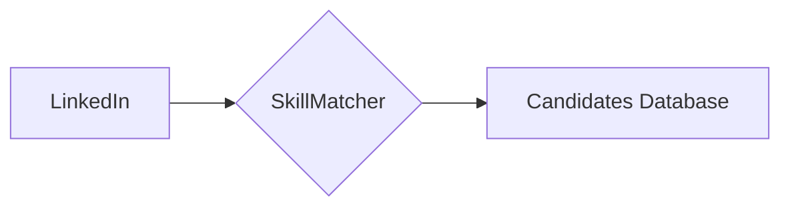

# SkillMatcher

Example for TestDoubles

## Problem statement:

Let's imagine we are creating a project that will connect a database of Jobs; 
and we will look at Candidates in LinkedIn to match with those Jobs.

We are going to create, using TDD, the SkillsMatcher module, which will provide methods to analyze how well a
Candidate matches the requirements of the Job.

Since we don't yet have implementations for the LinkedIn Candidates module (and that would depend on network connection,
API permissions and maybe other dependencies), neither for the Candidates database (huge dependency that can make unit tests
slower or flakier), we need to create test infrastructure that enables us to develop and test while the dependencies are not available.

## First iteration - main up to [end of lecture](https://github.com/BguardiaOpen/TestDoubles-SkillMatcher/releases/tag/EndOfLecture)

- Created the SkillMatcher project. Created basic API with two methods (and empty implementation):
  - Calculating a percentage (0-100+) of match between a job and a candidate
  - Calculating a list of percentages (0-100+) of match between each skill defined in a job and in a candidate
- Created interfaces for Skills and Jobs
- Created a failing test. To get here, we needed to create Test objects fulfilling the interface - a Stub
	- The Stub was built with three classes: TestCandidate, TestJob, TestSkill, which are pretty much data containers in this case but on bigger examples can become much harder
- Got the test to pass
- Changed test to match realistic expectations of the desired behavior
- Changed the implementation to a trivial O(N^2) all skills in the job vs. all skills in the candidate match
- Got the test to fail

## Second iteration - next [commit](https://github.com/BguardiaOpen/TestDoubles-SkillMatcher/commit/a7e454b5c51dc0832565fb2109a7e698d83ac0e7) in main 

- Fixed the code and the tests to produce what we expected

## Third iteration - new branch "convertToMocks"

- Changed unit test implementation to mocks
- Added documentation
- Removed Stub!
